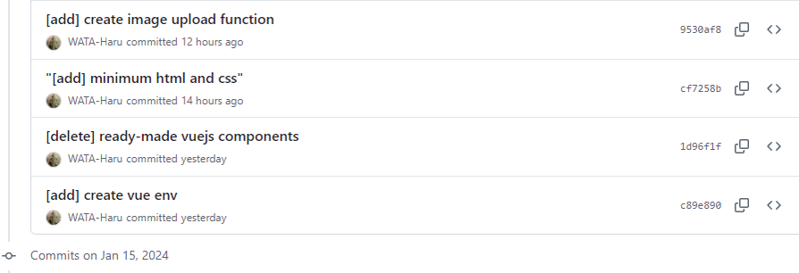
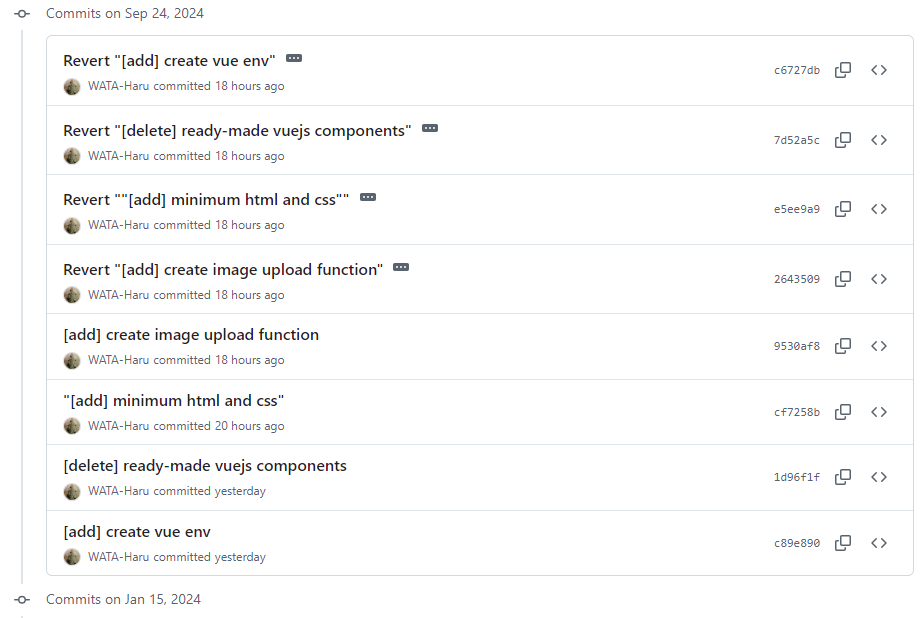

# replay.sh
1. 使用する場合は空のディレクトリを用意
2. ```replay.sh```だけ移動
3. ```bash replay.sh```で実行される


# まとめ
## やったこと
review回のdevelopに直接pushしてしまいました。(push済み)   
間違ったcommitを取り消し、新しいbranchを切ってそこでpushします。

#### これを


#### こうします。


ついでに取り消したcommitを自分のbranchで再度commitしなおしてpushします。

## TL;DR
1. git revertでcommitを(歴史を書き換えずに)すべて取り消す
   ```git revert {取り消したいcommitの一つ前}...{commitID}```
2. あたらしいbranchを作成する。
3. git cherry-pickで本来積むはずだったcommitを取得して積む
   ```git cherry-pick commit1 commit2 commit3```
### キーワード
```bash
git revert {commit}...{commit}
git log --oneline branch
git fetch origin branch
git switch branch
git cherry-pick commitA commitB commitC
```
## やらかし再現
### 下準備
git の環境を作成します。
commitを積み増す。次に、取り消す予定のcommitを4つ積みます。
```bash
# initialize and rename branch
git init
git branch -M main

# create files
touch hoge huga piyo
git add .
git commit hoge -m "commit1 hoge"
git commit huga -m "commit2 huga"
git commit piyo -m "commit3 piyo"
git log --oneline main

# create files (will be revert)
touch file1 file2 file3 file4
git add .
git commit file1 -m "revertMe! 1"
git commit file2 -m "revertMe! 2"
git commit file3 -m "revertMe! 3"
git commit file4 -m "revertMe! 4"

```

#### 結果
```bash
## result
# fa6dac6 (HEAD -> main) revertMe! 4
# 1404f9a revertMe! 3
# 87ca0ef revertMe! 2
# 18069f3 revertMe! 1
# 720ea93 commit3 piyo
# 62e5fbd commit2 huga
# 842bf46 commit1 hoge
```

### git revert
commitを確認し以下でまとめてcommitを取り消します。
```bash
# 1. commitIDを使用するパターン
git revert {startCommitID}...{endCommitID}
# 2. HEAD~Nを使用するパターン
git revert HEAD~N...HEAD 
```
1. startCommitは取り消したいcommitIDの一つ前のcommitIDを指定してください。
2. HEAD~Nを使用する場合には、```git log --oneline main```でHEADから数えてN個前のcommitIDを指定します。1スタートで良いです。
イメージ
```bash
## result
# fa6dac6 (HEAD -> main) revertMe! 4 #HEADから1
# 1404f9a revertMe! 3 #HEADから2
# 87ca0ef revertMe! 2 #HEADから3
# 18069f3 revertMe! 1 #HEADから4
# 720ea93 commit3 piyo
# 62e5fbd commit2 huga
# 842bf46 commit1 hoge
```
#### 結果
```bash
# result
# f17c4f7 (HEAD -> main) Revert "revertMe! 1"
# b0ca0e3 Revert "revertMe! 2"
# de4cfd7 Revert "revertMe! 3"
# 1cbc944 Revert "revertMe! 4"
# fa6dac6 revertMe! 4
# 1404f9a revertMe! 3
# 87ca0ef revertMe! 2
# 18069f3 revertMe! 1
```

## git fetch -> cherry-pick
git revertしてしまったが、本来は別Branchで作りたかったはずだ。
過去のcommit履歴からcherry-pickすればまたcommitを積むことができる。
(この場合はrevertMe! 1 ~ revertMe! 4までを救出)
```
git switch -c newBranch
git cherry-pick {commitID}...
```

注意: untrackedのファイルがあると使えないので注意

## tips

### git resetで消す方法(pushしていないことが前提)

git restoreは期間指定する必要がない。指定したcommitまでずらす
```bash
git reset HEAD~N
# or
git reset commitID
```
ファイルを削除してもokの場合は`git reset --hard commitID` でok
###  誤ったrevertのcommitを取り消し、再度revertする
例えば、間違ってrevertした場合に、revetのcommitを```git reset --hard commitID```で消すと。以下のエラーが出る。
```bash
error: revert is already in progress hint: try "git revert (--continue | --abort | --quit)"
```

**revert作業中はさらにrevertができない**
また、revertのcommitの前までresetしてもrevert最中と判定されるようである。そこで、```--continue``` ```--abort``` ```quit```を使う。

1. ```--continue```では取り消したrevertが再生される。
3. ```--abort```では、Revertを中止できる。
4. ```--quit```では一時停止させる。
この場合は```--abort```を使用して再度Revertすればok
### git revertでrevert のcommitを作らない
```-n```を使うとrevertのcommitが作られなくなる。複数commitする際に便利
```git revert --help```参照
>ツリーとインデックスに適用しますが、コミットは行いません。
```bash
git revert -n HEAD~4...HEAD
```

### remote branchからlocal branchを作成する方法

```
git branch branchName origin/branchName`
git switch branchName
```

